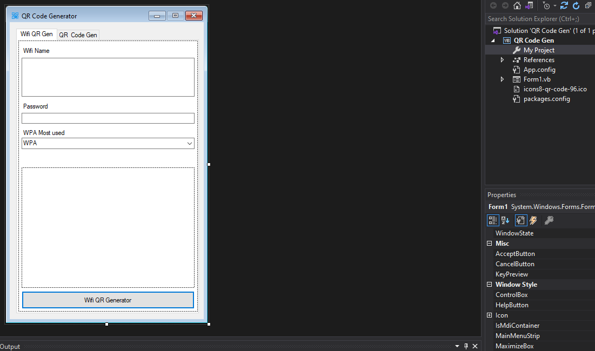
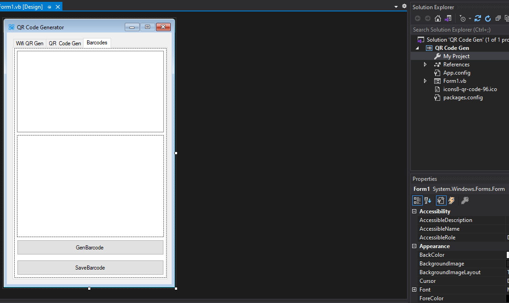

# QR-Code-Generator
QR-Code-Generator

### Video Youtube: [مجهول عربي](https://youtu.be/rEGTafcHLzs)  

#AR

Imports وتعريف الـ Classes:

في بداية الكود، تم استيراد مجموعة من المكتبات والفئات التي يحتاجها التطبيق.
تم استيراد مكتبات مثل System.Drawing.Printing و System.IO و ZXing و IronBarCode و Emgu.CV.
تم تعريف فئة Form1 التي تمثل النموذج الرئيسي للتطبيق.
أحداث وظيفية:

تم تعريف أحداث مثل CheckBoxCustomSize_CheckedChanged و Form1_Load و ButtonGenerateQR_Click و ButtonGenerateWifiQR_Click و ButtonGenerateBarcode_Click و ButtonSaveBarcode_Click.
تلك الأحداث تتعامل مع تغييرات المستخدم وتفاعلاته في واجهة المستخدم.
الوظائف:

CheckBoxCustomSize_CheckedChanged: هذه الوظيفة تتحقق مما إذا كانت خانة الاختيار CheckBoxCustomSize محددة أو لا، وتفعّل أو تعطيل عناصر تحكم الأبعاد المخصصة بناءً على ذلك.
Form1_Load: تقوم بتكوين الواجهة الرئيسية للتطبيق عند تحميل النموذج.
ButtonGenerateQR_Click: تُستدعى عند النقر على زر إنشاء رمز الاستجابة السريعة، حيث يتم إنشاء وعرض QR code استنادًا إلى البيانات المدخلة في TextBoxQRData.
ButtonGenerateWifiQR_Click: تُستدعى عند النقر على زر إنشاء رمز الاستجابة السريعة للواي فاي، حيث يتم إنشاء وعرض QR code استنادًا إلى بيانات شبكة الواي فاي المدخلة.
ButtonGenerateBarcode_Click: تُستدعى عند النقر على زر إنشاء الباركود، حيث يتم إنشاء وعرض باركود استنادًا إلى البيانات المدخلة في TextBoxbarcodes.
ButtonSaveBarcode_Click: تُستدعى عند النقر على زر حفظ الباركود، حيث يتم حفظ الصورة المعروضة في PictureBoxbarcodes.
توليد الباركود ورموز الاستجابة السريعة:

يتم توليد الباركود ورموز الاستجابة السريعة باستخدام مكتبات مختلفة مثل ZXing وIronBarCode.
تم تحديد نوع الباركود المطلوب باستخدام ComboBoxBarcodeType.
يتم توليد الباركود أو رمز الاستجابة السريعة وعرضها في PictureBox المخصصة.
حفظ الصور:

توجد وظيفة SaveImage لحفظ الصورة المولدة، والتي تم استدعاؤها من عدة أماكن في التطبيق.
HandleBarcodeInput:

هذه الوظيفة تتعامل مع إدخال الباركود في TextBoxbarcodes.
يتم التحقق من الخيار المحدد في ComboBoxBarcodeType وتنفيذ العملية المناسبة بناءً على النوع المحدد.
يتم التحقق من أن النص في TextBoxbarcodes يحتوي على عدد محدد من الأرقام والسماح فقط بإدخال الأرقام.
SaveImage:

هذه الوظيفة تقوم بحفظ الصورة المعروضة في PictureBoxQR بتنسيق محدد (PNG، JPEG، BMP) بعد اختيار المستخدم.
ButtonPrint_Click:

هذه الوظيفة تقوم بطباعة الصورة المعروضة في PictureBoxQR.
يتم تحديد إذا كان المستخدم قد حدد تخصيص الحجم والتصميم أم لا، ويتم طباعة الصورة بالحجم المحدد إذا كان ذلك مطلوبًا.
ButtonButtonPreview_Click:

هذه الوظيفة تقوم بعرض معاينة للصورة المعروضة في PictureBoxQR، مما يسمح للمستخدم برؤية كيفية طباعتها قبل الطباعة الفعلية.
Gen Number و Word Gen و Gen Number And Words:

هذه الوظائف تولد سلسلة نصية عشوائية من الأرقام فقط، أو الحروف فقط، أو مزيج من الحروف والأرقام بناءً على القيم المحددة في NumericUpDown.
Scann Code:

هذه الوظيفة تقوم بمحاولة قراءة باركود من صورة محملة من الكاميرا أو عبر الإنترنت.
تستخدم هذه الوظيفة مكتبة ZXing لقراءة الباركود.
OpenCamera و DownloadImageFromUrl و btnOpenCamera_Click و btnLoadFromUrl_Click:

هذه الوظائف تقوم بفتح الكاميرا وتحميل الصورة من عنوان URL عبر الإنترنت.

-- --

# EN
Imports and definition of Classes:

At the beginning of the code, a set of libraries and classes needed by the application are imported.
Libraries such as System.Drawing.Printing, System.IO, ZXing, IronBarCode and Emgu.CV are imported.
The Form1 class is defined, which represents the main form of the application.
Functional events:

Events such as CheckBoxCustomSize_CheckedChanged, Form1_Load, ButtonGenerateQR_Click, ButtonGenerateWifiQR_Click, ButtonGenerateBarcode_Click and ButtonSaveBarcode_Click are defined.
These events handle user changes and interactions in the user interface.
Jobs:

CheckBoxCustomSize_CheckedChanged: This function checks whether the CheckBoxCustomSize check box is checked or not, and enables or disables custom dimension controls accordingly.
Form1_Load: Configures the main interface of the application when the form is loaded.
ButtonGenerateQR_Click: Called when the Generate QR Code button is clicked, the QR code is generated and displayed based on the data entered in the TextBoxQRData.
ButtonGenerateWifiQR_Click: Called when the Generate Wi-Fi QR Code button is clicked, a QR code is generated and displayed based on the entered Wi-Fi network data.
ButtonGenerateBarcode_Click: Called when the generate barcode button is clicked, a barcode is generated and displayed based on the data entered in TextBoxbarcodes.
ButtonSaveBarcode_Click: Called when the Save Barcode button is clicked, the displayed image is saved in PictureBoxbarcodes.
Generate barcodes and QR codes:

Barcodes and QR codes are generated using different libraries such as ZXing and IronBarCode.
The desired barcode type is specified using ComboBoxBarcodeType.
The barcode or QR code is generated and displayed in the customized PictureBox.
saving photos:

There is a SaveImage function to save the generated image, which is called from several places in the application.
HandleBarcodeInput:

This function handles entering barcodes into TextBoxbarcodes.
The option specified in ComboBoxBarcodeType is checked and the appropriate operation is performed based on the type specified.
TextBoxbarcodes check that text contains a specified number of numbers and only allow numbers to be entered.
SaveImage:

This function saves the image displayed in PictureBoxQR in a specified format (PNG, JPEG, BMP) after user selection.
ButtonPrint_Click:

This function prints the image displayed in PictureBoxQR.
It determines whether the user has selected customizable size and design, and the image is printed at the specified size if required.
ButtonButtonPreview_Click:

This function displays a preview of the image displayed in PictureBoxQR, allowing the user to see how it will print before actually printing.
Gen Number and Word Gen and Gen Number And Words:

These functions generate a random text string of numbers only, letters only, or a combination of letters and numbers based on the values specified in NumericUpDown.
Scann Code:

This function attempts to read a barcode from an image uploaded from the camera or via the Internet.
This function uses ZXing library to read barcodes.
OpenCamera, DownloadImageFromUrl, btnOpenCamera_Click, btnLoadFromUrl_Click:

These functions open the camera and load the image from an online URL.

